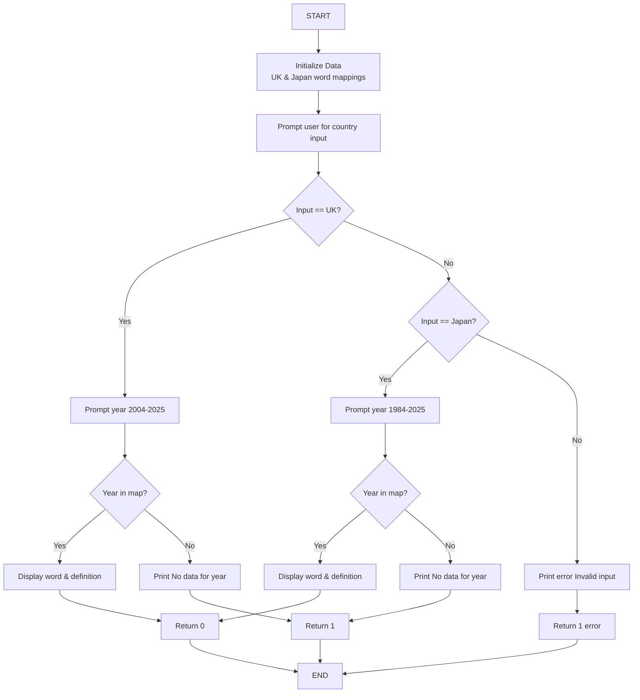

```mermaid
flowchart TD
    START[START] --> Init[Initialize Data<br/>UK & Japan word mappings]
    Init --> PromptCountry[Prompt user for country input]
    PromptCountry --> UK{Input == UK?}
    UK -->|Yes| PromptYearUK[Prompt year 2004-2025]
    UK -->|No| JapanCheck{Input == Japan?}
    JapanCheck -->|Yes| PromptYearJapan[Prompt year 1984-2025]
    JapanCheck -->|No| Error[Print error Invalid input]
    PromptYearUK --> YearCheckUK{Year in map?}
    PromptYearJapan --> YearCheckJapan{Year in map?}
    YearCheckUK -->|Yes| DisplayUK[Display word & definition]
    YearCheckUK -->|No| NoDataUK[Print No data for year]
    YearCheckJapan -->|Yes| DisplayJapan[Display word & definition]
    YearCheckJapan -->|No| NoDataJapan[Print No data for year]
    Error --> Return1Error[Return 1 error]
    NoDataUK --> Return1NoData[Return 1]
    NoDataJapan --> Return1NoData
    DisplayUK --> Return0[Return 0]
    DisplayJapan --> Return0
    Return1Error --> END[END]
    Return1NoData --> END
    Return0 --> END
```
