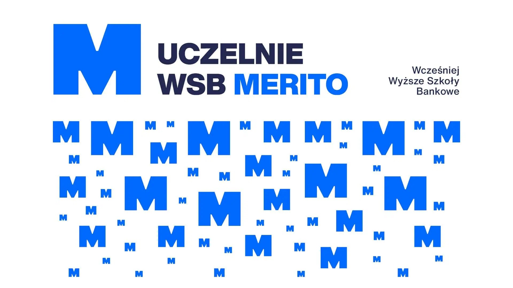

```mermaid
flowchart ID
A[Start} --> B[Etap 1]
B --> C[Stop]
```


Do zrobienia
- [] zadanie 1
- [] zadanie 2

# duży nagłówek
regularny tekst
**pogrubiony tekst** dajej tekst bez podrubiebia a tytaj kursywa
## trochę mniejszy nagłówek
kolejny tekst
### najmniejszy nagłówek
ostatni tekst
- pierwszy element
- drugi element listy
  - podpunkt

<pre>fragment kodu</pre> w ramach tekstu
```
 cout << "Choose the country of origin of the term:\n";
    cin >> countryInput;

        if (countryInput == "UK")
    {
        cout << "Choose the year from 2004 to 2025:\n";
        cin >> yearInput;

        if (wordData["UK"].count(yearInput))
        {
            cout << "\nThe word of the year " << yearInput << " is:\n";
            auto [word, definition] = wordData["UK"][yearInput];
            cout << word << " - " << definition << "\n";
        }
  }
```
[tutaj jest link](https://www.merito.pl/)


